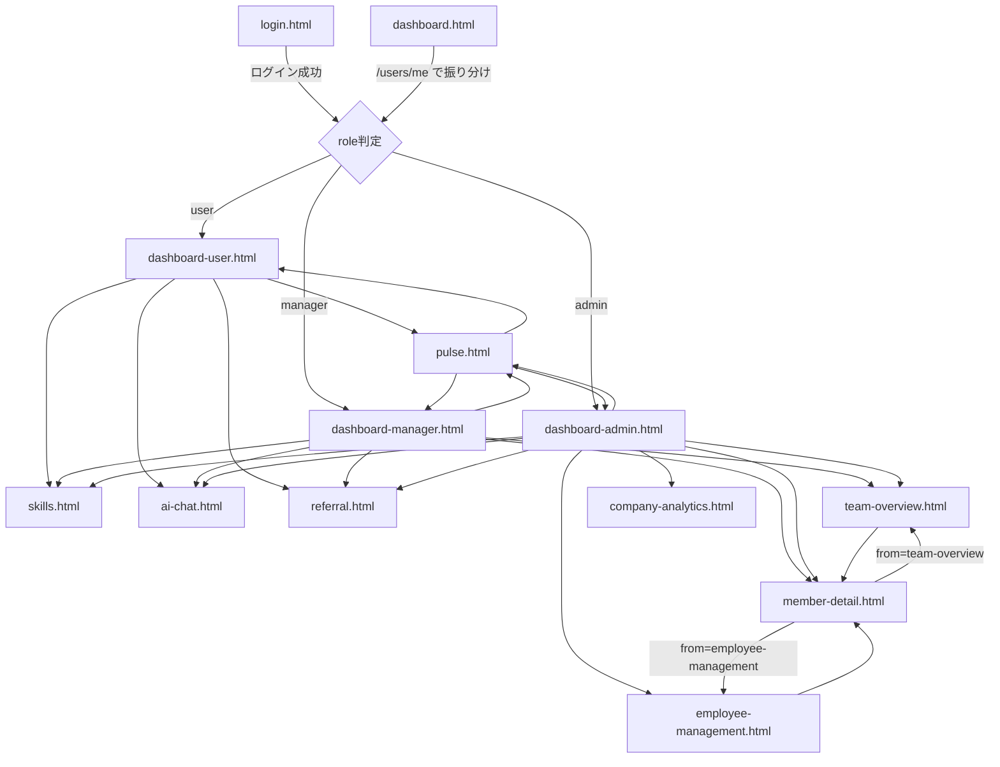
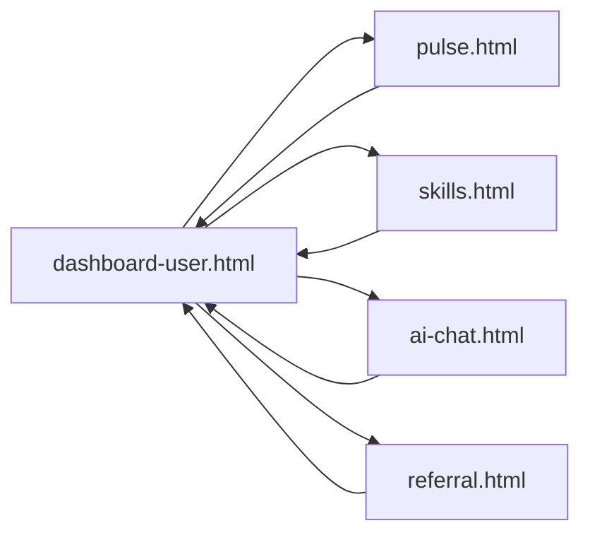
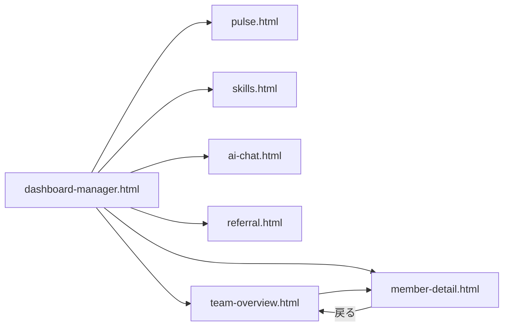
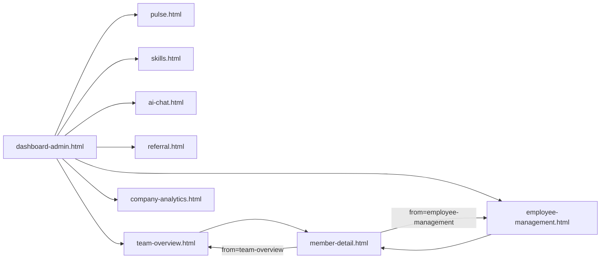

# 画面遷移仕様書

## 概要

People Success Navigator の現状実装をもとに、画面間の遷移関係を整理した資料です。  
本書は **静的 HTML / JavaScript の遷移実装** を優先して記載しており、将来的な要件や未実装遷移は含めていません。

対象ディレクトリ:

- 画面: `backend/app/static/`
- フロントスクリプト: `backend/app/static/js/`

前提:

- 認証トークンは `localStorage.access_token` に保存されます。
- ログイン済み画面の多くは `app-shell.js` により `/users/me` を用いて権限制御を行います。
- 権限に応じてアクセス不可の画面へ直接入った場合は、各ロールのダッシュボードへリダイレクトされます。
- `member-detail.html` は独立メニューではなく、一覧・ダッシュボードからの詳細導線用画面です。

---

## 1. 画面一覧

| 区分 | 画面 | ファイル | 主な役割 |
|---|---|---|---|
| 認証 | ログイン | `login.html` | 認証実行、トークン保存 |
| 振り分け | ダッシュボード振り分け | `dashboard.html` | ロールに応じた初期画面へ遷移 |
| user | ユーザーダッシュボード | `dashboard-user.html` | 本人の Pulse 状況確認 |
| manager | マネージャーダッシュボード | `dashboard-manager.html` | チーム状況・リスク確認 |
| admin | 管理者ダッシュボード | `dashboard-admin.html` | 全体サマリ確認 |
| 共通 | Pulse Survey | `pulse.html` | 日次 Pulse 入力・履歴閲覧 |
| 共通 | スキル成長 | `skills.html` | UI モック |
| 共通 | AI相談 | `ai-chat.html` | UI モック |
| 共通 | リファラル | `referral.html` | UI モック |
| manager/admin | チーム状況 | `team-overview.html` | メンバー一覧・状態確認 |
| manager/admin | メンバー詳細 | `member-detail.html` | 個別 Pulse 履歴確認 |
| admin | 全社分析 | `company-analytics.html` | UI モック |
| admin | 社員管理 | `employee-management.html` | ユーザー管理・詳細導線 |
| 未使用 | 入口 | `index.html` | 空ファイル |

---

## 2. 画面遷移全体図



補足:

- `pulse.html` から各ダッシュボードへ直接戻る専用ボタンはありませんが、共通サイドバーからロール別ダッシュボードへ遷移できます。
- `skills.html` `ai-chat.html` `referral.html` `company-analytics.html` は現状モック中心ですが、サイドバー導線は実装されています。
- `dashboard.html` は中継用途で、業務画面としては使用しません。

---

## 3. 認証・初期遷移

## 3.1 未ログイン時

開始点は `login.html` です。

想定フロー:

1. ユーザーが ID / パスワードを入力
2. `POST /auth/login` を実行
3. JWT を `localStorage.access_token` に保存
4. `GET /users/me` でロール取得
5. ロールに応じてダッシュボードへ遷移

遷移先:

- `admin` → `dashboard-admin.html`
- `manager` → `dashboard-manager.html`
- `user` → `dashboard-user.html`

## 3.2 中継ページ `dashboard.html`

`dashboard.html` は保存済みトークンがある前提で、`/users/me` を利用してロール別ダッシュボードへ振り分けるページです。

用途:

- 起動時の仮エントリーポイント
- 認証済みユーザーの初期遷移整理

実質的には表示画面ではなく、リダイレクト用ページです。

---

## 4. ロール別ナビゲーション

## 4.1 user ロール

`app-shell.js` の現状実装では、`user` が遷移可能な画面は以下です。

- `dashboard-user.html`
- `pulse.html`
- `skills.html`
- `ai-chat.html`
- `referral.html`

### 遷移図



補足:

- 厳密には各画面から相互にサイドバー遷移できます。
- `member-detail.html` `team-overview.html` `employee-management.html` `company-analytics.html` は `user` ではアクセス不可です。

## 4.2 manager ロール

遷移可能画面:

- `dashboard-manager.html`
- `pulse.html`
- `skills.html`
- `ai-chat.html`
- `referral.html`
- `team-overview.html`
- `member-detail.html`

### 遷移図



補足:

- `dashboard-manager.html` の各一覧・アラート行から `member-detail.html` へ遷移できます。
- `team-overview.html` の各メンバー行から `member-detail.html` へ遷移できます。
- `member-detail.html` へ直接アクセスした場合でも、ロールとして manager であれば許可されます。

## 4.3 admin ロール

遷移可能画面:

- `dashboard-admin.html`
- `pulse.html`
- `skills.html`
- `ai-chat.html`
- `referral.html`
- `team-overview.html`
- `company-analytics.html`
- `employee-management.html`
- `member-detail.html`

### 遷移図



補足:

- `dashboard-admin.html` からはカード・ボタン導線で `employee-management.html` と `company-analytics.html` へ遷移します。
- `employee-management.html` の社員一覧から `member-detail.html` へ遷移します。
- `admin` は `team-overview.html` にも入れますが、メニュー上の中心導線は `dashboard-admin.html` と `employee-management.html` です。

---

## 5. 画面別の主な遷移

## 5.1 `login.html`

### 遷移元

- 未ログイン状態での起点
- トークン切れ・権限エラー時の遷移先
- ログアウト時の遷移先

### 遷移先

- `dashboard-admin.html`
- `dashboard-manager.html`
- `dashboard-user.html`

### 備考

- 認証失敗時は同画面に留まりエラーメッセージ表示
- 画面下層からの戻り導線ではなく、認証の唯一入口として扱う想定

## 5.2 `dashboard-user.html`

### 主な遷移先

- `pulse.html`（入力画面へ / 回答履歴を開く）
- `ai-chat.html`（AI相談を見る）
- `referral.html`（紹介画面へ）
- `skills.html`（詳細を見る）

### 備考

- user 向けホーム画面
- 個人詳細画面などの深掘り導線は持たない

## 5.3 `dashboard-manager.html`

### 主な遷移先

- `team-overview.html`（チーム状況を開く / 詳細を見る / 一覧を見る）
- `member-detail.html`（メンバー行の「詳細」）
- `pulse.html`
- `skills.html`
- `ai-chat.html`
- `referral.html`

### 備考

- チーム一覧の詳細ボタンは、クエリパラメータ付きで `member-detail.html` を開く実装です。
- `from=dashboard-manager` が付与されても、戻り先は現状 `team-overview.html` 扱いではなく、`member-detail.js` 上では `team-overview.html` 既定戻りになります。

## 5.4 `dashboard-admin.html`

### 主な遷移先

- `employee-management.html`
- `employee-management.html#register`
- `employee-management.html#departments`
- `company-analytics.html`
- `pulse.html`
- `skills.html`
- `ai-chat.html`
- `referral.html`
- `team-overview.html`

### 備考

- 現状の管理者ホームとして、社員管理と全社分析へのハブ機能を持ちます。
- `member-detail.html` への直接導線は画面本体からは持たず、通常は `employee-management.html` などを経由します。

## 5.5 `pulse.html`

### 主な遷移元

- 各ロールのダッシュボード
- 共通サイドバー

### 主な遷移先

- 明示的な完了遷移はなし
- 同画面内で入力・履歴閲覧を完結
- サイドバーから各ロールの許可画面へ遷移可能

### 備考

- フォーム送信後も原則そのまま `pulse.html` に留まります。
- ログイン状態不備時は `login.html` へ遷移します。

## 5.6 `team-overview.html`

### 主な遷移元

- `dashboard-manager.html`
- `dashboard-admin.html`
- サイドバー

### 主な遷移先

- `member-detail.html`

### 備考

- 各行の「詳細へ」から `member-detail.html` に遷移します。
- 遷移時には以下のような文脈情報をクエリで引き渡します。
  - `user_id`
  - `name`
  - `role`
  - `department`
  - `manager`
  - `from=team-overview`

## 5.7 `employee-management.html`

### 主な遷移元

- `dashboard-admin.html`
- サイドバー

### 主な遷移先

- `member-detail.html`

### 備考

- 社員一覧の「詳細を見る」から `member-detail.html` に遷移します。
- クエリに `from=employee-management` を付けるため、詳細画面の戻る導線は `employee-management.html` になります。
- `#register` `#departments` は同一ページ内アンカー遷移です。

## 5.8 `member-detail.html`

### 主な遷移元

- `dashboard-manager.html` の詳細ボタン
- `team-overview.html` の詳細ボタン
- `employee-management.html` の詳細ボタン

### 主な遷移先

- `team-overview.html`
- `employee-management.html`

### 戻り先判定

`member-detail.js` の現状実装:

- `from=employee-management` の場合 → `employee-management.html`
- 上記以外 → `team-overview.html`

### 注意点

- `from=dashboard-manager` で遷移しても、戻り先は専用に `dashboard-manager.html` ではなく `team-overview.html` です。
- そのため、「ダッシュボードから詳細へ → 戻る」で元のダッシュボードに復帰する実装にはなっていません。

## 5.9 `company-analytics.html`

### 主な遷移元

- `dashboard-admin.html`
- サイドバー

### 主な遷移先

- サイドバー経由の各 admin 許可画面

### 備考

- 現状は UI モック中心で、専用の詳細遷移は持ちません。

## 5.10 `skills.html` / `ai-chat.html` / `referral.html`

### 主な遷移元

- 各ロールのサイドバー
- 一部ダッシュボードの CTA

### 主な遷移先

- サイドバー経由の各許可画面

### 備考

- 現状はモック・簡易画面としての性格が強く、個別の業務フロー分岐はまだありません。

---

## 6. 詳細画面遷移で利用しているクエリパラメータ

`member-detail.html` では URL クエリから対象メンバー文脈を受け取ります。

| パラメータ | 用途 |
|---|---|
| `user_id` | Pulse 履歴取得対象ユーザーID |
| `name` | 画面表示用の氏名 |
| `role` | 表示用ロール |
| `department` | 表示用部署 |
| `manager` | 表示用上長名 |
| `from` | 戻り先制御用の遷移元識別 |

利用例:

```text
./member-detail.html?user_id=12&name=山田太郎&role=user&department=開発部&manager=佐藤花子&from=team-overview
```

設計意図:

- 一覧画面側で最低限の文脈を持ったまま詳細画面へ遷移する
- 詳細画面では API から Pulse 履歴を取得しつつ、ヘッダ情報はクエリでも初期表示できるようにする

注意点:

- クエリ情報は表示補助用途であり、真正な権限判定はしていません。
- データ整合性の起点は `user_id` と API 応答です。

---

## 7. 権限制御によるリダイレクト

`app-shell.js` による画面アクセス制御の現状仕様です。

### 制御方針

1. `GET /users/me` でログインユーザー取得
2. 現在の HTML ファイル名を取得
3. ロールごとの許可画面リストに含まれるか判定
4. 不許可ならロール別ダッシュボードへ `window.location.replace()`

### ロール別許可画面

| role | 許可画面 |
|---|---|
| `user` | `dashboard-user.html`, `pulse.html`, `skills.html`, `ai-chat.html`, `referral.html` |
| `manager` | 上記 + `dashboard-manager.html`, `team-overview.html`, `member-detail.html` |
| `admin` | 上記 + `dashboard-admin.html`, `company-analytics.html`, `employee-management.html`, `member-detail.html` |

### リダイレクト先

- `admin` → `dashboard-admin.html`
- `manager` → `dashboard-manager.html`
- `user` → `dashboard-user.html`

---

## 8. ログアウト・認証切れ時の遷移

ログアウトまたは認証エラー時の遷移先は `login.html` です。

主な契機:

- 画面右上のログアウトボタン押下
- `/users/me` 取得失敗
- `pulse.html` `dashboard-user.js` などでトークン不備検知

動作:

1. `localStorage.access_token` を削除
2. `login.html` へ遷移

---

## 9. 現状の遷移仕様上の注意点

## 9.1 `member-detail.html` の戻り先が限定的

現状の戻り先判定は以下のみです。

- `employee-management` → 社員管理へ戻る
- それ以外 → チーム状況へ戻る

そのため、以下は未対応です。

- `dashboard-manager.html` へ正確に戻す
- `dashboard-admin.html` へ正確に戻す
- 絞り込み状態や並び替え状態を保持して戻す

## 9.2 モック画面は業務フロー未確定

以下の画面はサイドバー遷移はあるものの、画面内アクションからの後続フローは未確定です。

- `skills.html`
- `ai-chat.html`
- `referral.html`
- `company-analytics.html`

## 9.3 `index.html` は未使用

`index.html` は空ファイルのため、現状の正式な入口としては `login.html` あるいは `dashboard.html` を利用する前提です。

---

## 10. 今後の拡張ポイント

現状のコードベースから見て、次に整理すると良い論点は以下です。

- 画面遷移図に「主要操作完了後の遷移」を追加する
- `member-detail.html` の戻り先を遷移元ごとに厳密化する
- 絞り込み条件・タブ状態・スクロール位置を URL や state に保持する
- モック画面の詳細フロー確定後、業務フローベースの遷移図へ更新する
- `dashboard.html` と `login.html` の正式な起動導線を README に合わせて一本化する

