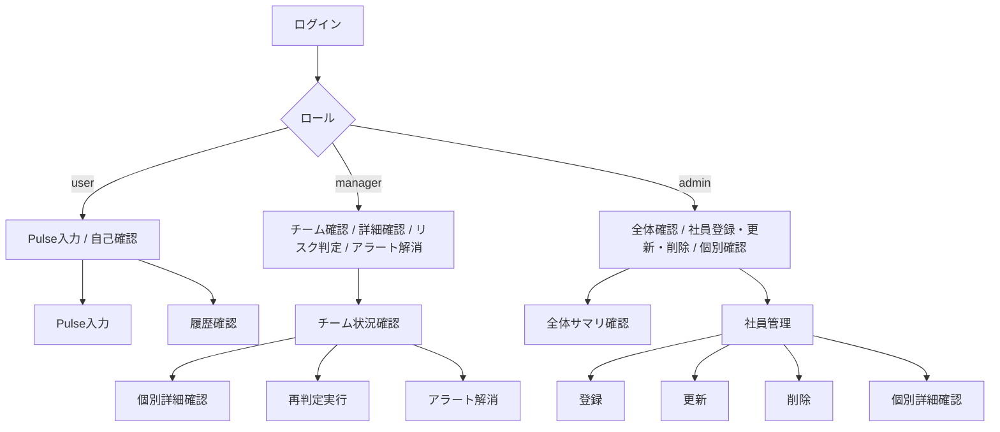

# ユースケース仕様書

## 概要

本書は People Success Navigator の現状実装をもとに、**業務フロー単位での操作手順** を整理した資料です。  
画面一覧や API 一覧ではなく、実際に利用者がどの順番で何を行うか、どの画面を通るか、どの結果を確認するかに焦点を当てています。

前提:

- 対象は現状実装済みの静的 HTML / JavaScript + FastAPI バックエンド構成です。
- 一部画面は UI モック段階のため、本書では実業務フローの中心には含めていません。
- ロールは `user` / `manager` / `admin` の 3 種です。
- 共通認証は JWT ベースで、ログイン後にロール別ダッシュボードへ遷移します。

関連資料:

- `screen_spec.md`: 画面ごとの仕様
- `screen_flow.md`: 画面遷移
- `api_spec.md`: API 仕様
- `db_design.md`: DB 設計
- `architecture.md`: システム構成

---

## 1. ロール別の主な利用目的

| ロール | 主な利用目的 |
|---|---|
| user | 自分の Pulse を入力し、最近の状態を確認する |
| manager | チームの状態・離職リスク・アラートを確認し、必要に応じて対処する |
| admin | ユーザー・部署の管理、全体状況の初期把握、管理導線の維持を行う |

---

## 2. ユースケース一覧

| ID | ユースケース名 | 主担当ロール | 主な画面 |
|---|---|---|---|
| UC-01 | ログインする | 全ロール | `login.html` |
| UC-02 | 自分の Pulse を入力する | user / manager / admin | `pulse.html` |
| UC-03 | 自分の Pulse 履歴を確認する | user / manager / admin | `dashboard-user.html`, `pulse.html` |
| UC-04 | マネージャーがチーム状況を確認する | manager | `dashboard-manager.html`, `team-overview.html` |
| UC-05 | マネージャーが高リスクメンバーの詳細を確認する | manager | `dashboard-manager.html`, `team-overview.html`, `member-detail.html` |
| UC-06 | マネージャーが離職リスク再判定を手動実行する | manager | `dashboard-manager.html` |
| UC-07 | マネージャーがアラートを解消する | manager | `dashboard-manager.html`, `team-overview.html` |
| UC-08 | 管理者が全体サマリを確認する | admin | `dashboard-admin.html` |
| UC-09 | 管理者が社員を登録する | admin | `employee-management.html` |
| UC-10 | 管理者が社員情報を変更する | admin | `employee-management.html` |
| UC-11 | 管理者が社員を削除する | admin | `employee-management.html` |
| UC-12 | 管理者が社員詳細を確認する | admin | `employee-management.html`, `member-detail.html` |

---

## 3. 共通業務フロー

## UC-01 ログインする

### 目的

- システムへ認証し、自分の権限に応じたホーム画面へ入る

### 主担当ロール

- 全ロール

### 事前条件

- ユーザーが有効なアカウントを持っている
- メールアドレスとパスワードが発行済みである

### 利用画面

- `login.html`
- 遷移先: `dashboard-user.html` / `dashboard-manager.html` / `dashboard-admin.html`

### 基本フロー

1. ユーザーが `login.html` を開く
2. メールアドレスとパスワードを入力する
3. ログインボタンを押下する
4. システムが認証 API を実行する
5. 認証成功時、アクセストークンを保存する
6. システムがユーザー情報を取得し、ロールを判定する
7. ロールに応じたダッシュボードへ遷移する

### 成功結果

- ログイン状態が保持される
- ユーザーは自分の利用可能画面へ遷移できる

### 代替 / 例外フロー

- 認証失敗時はログイン画面に留まり、エラーメッセージを表示する
- トークン不正や期限切れ時はログイン画面へ戻される

---

## UC-02 自分の Pulse を入力する

### 目的

- その日のコンディションを回答し、履歴として記録する

### 主担当ロール

- `user`
- `manager`
- `admin`

### 事前条件

- ログイン済みである

### 利用画面

- `pulse.html`

### 基本フロー

1. ユーザーがサイドバーまたは導線から `pulse.html` を開く
2. システムが既存の Pulse 履歴を取得する
3. 当日分が未回答であれば、入力フォームを表示する
4. ユーザーが当日の状態を入力する
5. 送信ボタンを押下する
6. システムが Pulse を保存する
7. 最新履歴を再取得し、画面を更新する

### 成功結果

- 当日分の Pulse が保存される
- 画面上で最新状態・履歴に反映される

### 業務上の意味

- 継続入力により個人・チームの状態変化を後続分析に利用できる

### 代替 / 例外フロー

- 当日すでに回答済みの場合、重複入力を制御または既存回答表示となる
- API エラー時は保存失敗メッセージを表示する

---

## UC-03 自分の Pulse 履歴を確認する

### 目的

- 最近のスコア推移、回答有無、連続回答日数を確認する

### 主担当ロール

- `user`
- `manager`
- `admin`

### 利用画面

- `dashboard-user.html`
- `pulse.html`

### 基本フロー

1. ユーザーがダッシュボードまたは Pulse 画面を開く
2. システムが本人の Pulse 履歴を取得する
3. 最新スコア、直近平均、連続回答日数、グラフを表示する
4. ユーザーが状態の変化を確認する

### 成功結果

- 本人がセルフモニタリングできる
- 未回答日の有無やコンディション変化を把握できる

### 補足

- 現状実装では、集計の一部はフロント側で計算している

---

## 4. manager 向け業務フロー

## UC-04 マネージャーがチーム状況を確認する

### 目的

- チーム全体の健康状態、スコア傾向、リスク分布を把握する

### 主担当ロール

- `manager`

### 事前条件

- manager 権限でログイン済みである
- 自チームメンバーが登録されている

### 利用画面

- `dashboard-manager.html`
- `team-overview.html`

### 基本フロー

1. マネージャーが `dashboard-manager.html` を開く
2. システムがチーム状態、推移、アラートを取得する
3. 画面にチーム人数、平均スコア、リスク分布、要対応メンバー一覧を表示する
4. 必要に応じて `team-overview.html` に遷移する
5. 一覧の絞り込み・並び替えを利用し、確認対象メンバーを絞る
6. 個別確認が必要なメンバーを選択する

### 成功結果

- チームの健康状態を一覧で把握できる
- 次に確認すべきメンバーを特定できる

### 業務上の意味

- 日々の 1on1、声掛け、フォロー対象の優先順位付けに使う

---

## UC-05 マネージャーが高リスクメンバーの詳細を確認する

### 目的

- 気になるメンバーの Pulse 推移や直近の状態を個別に確認する

### 主担当ロール

- `manager`

### 利用画面

- `dashboard-manager.html`
- `team-overview.html`
- `member-detail.html`

### 基本フロー

1. マネージャーがダッシュボードまたはチーム一覧から対象メンバーを選択する
2. システムが `member-detail.html` へ遷移する
3. システムが対象メンバーの Pulse 履歴を取得する
4. 画面に時系列の状態、推移グラフ、最近の回答状況を表示する
5. マネージャーが状態悪化の継続有無や直近傾向を確認する
6. 必要に応じて元画面へ戻る

### 成功結果

- 高リスク判定の背景を個別に確認できる
- 対応要否や優先度を判断しやすくなる

### 補足

- `member-detail.html` は `from` パラメータにより戻り先が変わる
- 現状は Pulse 履歴中心で、面談記録やコメント管理までは未実装

---

## UC-06 マネージャーが離職リスク再判定を手動実行する

### 目的

- 最新の Pulse 状況にもとづき、離職リスク評価を更新する

### 主担当ロール

- `manager`

### 利用画面

- `dashboard-manager.html`

### 基本フロー

1. マネージャーがダッシュボードを開く
2. 再判定対象期間を選択する
3. 再判定実行ボタンを押下する
4. システムが離職リスク判定 API を呼び出す
5. 判定結果にもとづいてアラートや表示内容が更新される
6. マネージャーが更新後の状態を確認する

### 成功結果

- 最新データを反映したリスク状態を確認できる

### 業務上の意味

- 定期バッチ以外に、必要なタイミングで追加判定できる

### 代替 / 例外フロー

- 対象期間が不正な場合はエラーとなる
- 判定対象データが不足している場合、変化がない可能性がある

---

## UC-07 マネージャーがアラートを解消する

### 目的

- 確認済み・対応済みのアラートを整理し、未対応アラートを明確にする

### 主担当ロール

- `manager`

### 利用画面

- `dashboard-manager.html`
- `team-overview.html`

### 基本フロー

1. マネージャーがアラート一覧を確認する
2. 対応済みのアラートを選択する
3. 解消操作を実行する
4. システムがアラート状態を更新する
5. 画面上の一覧・件数を再表示する

### 成功結果

- アラートの未対応件数が最新化される
- 次に見るべき未解消アラートが明確になる

### 補足

- 現状は `is_resolved` の切り替えが中心で、詳細な対応履歴は持たない

---

## 5. admin 向け業務フロー

## UC-08 管理者が全体サマリを確認する

### 目的

- ユーザー数、ロール内訳、部署数などの全体情報を把握する

### 主担当ロール

- `admin`

### 利用画面

- `dashboard-admin.html`

### 基本フロー

1. 管理者が `dashboard-admin.html` を開く
2. システムがユーザー一覧・部署一覧を取得する
3. 総ユーザー数、manager 数、user 数、部署数を表示する
4. 最近追加されたユーザー一覧を確認する
5. 必要に応じて社員管理画面へ遷移する

### 成功結果

- システム利用状況の概要を短時間で把握できる

### 補足

- 現状は高度分析ではなく、管理者向けサマリ表示が中心

---

## UC-09 管理者が社員を登録する

### 目的

- 新規利用者をシステムへ追加する

### 主担当ロール

- `admin`

### 利用画面

- `employee-management.html`

### 事前条件

- 登録対象の氏名、メール、ロール、部署などが整理されている

### 基本フロー

1. 管理者が社員管理画面を開く
2. 新規登録フォームを開く
3. 必要情報を入力する
4. 登録実行ボタンを押下する
5. システムがユーザー作成 API を実行する
6. 一覧を再読み込みし、新規ユーザーが表示される

### 成功結果

- 新規社員がログイン可能な状態で登録される
- 社員一覧や管理ダッシュボードの件数に反映される

### 代替 / 例外フロー

- 必須項目不足や重複メールアドレスの場合は登録失敗となる

---

## UC-10 管理者が社員情報を変更する

### 目的

- 既存ユーザーのロール、部署、上長情報を最新状態へ保つ

### 主担当ロール

- `admin`

### 利用画面

- `employee-management.html`

### 基本フロー

1. 管理者が社員一覧を表示する
2. 対象社員を検索・絞り込み・選択する
3. 変更したい項目を編集する
4. 更新操作を実行する
5. システムが対象 API を呼び出して属性を更新する
6. 一覧表示を更新し、変更内容を確認する

### 対象項目

- ロール変更
- 部署変更
- マネージャー変更

### 成功結果

- 権限や所属情報が最新状態になる
- 以降の画面表示・集計・アクセス制御に反映される

### 補足

- 現状は項目ごとに API が分かれている

---

## UC-11 管理者が社員を削除する

### 目的

- 不要になったアカウントを削除し、一覧と管理対象を整理する

### 主担当ロール

- `admin`

### 利用画面

- `employee-management.html`

### 基本フロー

1. 管理者が社員一覧から削除対象を選択する
2. 削除操作を実行する
3. システムが確認ダイアログ等を表示する
4. 管理者が確定する
5. システムが削除 API を呼び出す
6. 一覧から対象ユーザーが除去される

### 成功結果

- 不要アカウントが管理対象から外れる

### 注意点

- 実データ保持方針が未確定の場合、論理削除への変更余地がある
- 将来的に履歴保持要件が出る場合は運用見直しが必要

---

## UC-12 管理者が社員詳細を確認する

### 目的

- 個別社員の Pulse 状況を確認し、異常値や継続傾向を把握する

### 主担当ロール

- `admin`

### 利用画面

- `employee-management.html`
- `member-detail.html`

### 基本フロー

1. 管理者が社員管理画面から対象社員を選択する
2. システムが `member-detail.html` に遷移する
3. 対象社員の Pulse 履歴を表示する
4. 必要に応じて元画面へ戻る

### 成功結果

- 管理者が個別ユーザーの状態を確認できる
- 登録ミスや異常傾向の初期把握に使える

### 補足

- manager と同様に詳細画面は Pulse 履歴中心である

---

## 6. モック / 将来拡張ユースケース

以下の画面は現状 UI モックまたは未接続のため、正式な業務フローとしてはまだ固定していません。

| 画面 | 現状 | 将来想定 |
|---|---|---|
| `ai-chat.html` | UI モック | 相談内容に応じた支援、ナレッジ補助 |
| `skills.html` | UI モック | スキル可視化、成長支援 |
| `referral.html` | UI モック | リファラル管理 |
| `company-analytics.html` | UI モック | 全社分析、組織横断レポート |

現段階では以下の扱いが適切です。

- 画面導線は存在する
- 業務上の正式運用フローにはまだ含めない
- 将来の仕様確定時にユースケースを追加する

---

## 7. 業務フロー全体の俯瞰

---

## 8. 現状運用上の注意点

### 8.1 フロント集計に依存する表示がある

- ダッシュボードや詳細画面の一部集計は、API の集約結果ではなくフロント側で計算している
- 表示定義を厳密化する場合は API 側へ集約する余地がある

### 8.2 manager / admin の確認導線が一部重なる

- `team-overview.html` と `member-detail.html` は manager / admin で共用している
- 誰がどの範囲を見られるべきかは、今後より厳密な制御が必要になる可能性がある

### 8.3 削除・履歴保持方針は未確定

- 現状は削除 API があるが、監査要件や履歴保持要件が固まると設計変更の可能性がある

### 8.4 モック画面の業務定義は今後追加

- AI相談、スキル成長、リファラル、全社分析は導線先としては存在するが、正式ユースケースは未確定

---

## 9. 今後追加しやすいユースケース候補

将来的に仕様が固まった段階で、以下のユースケースを追加しやすい構成です。

- 1on1 記録を登録する
- 離職リスク判定を定時バッチで実行する
- AI相談内容を保存・再参照する
- スキル目標を登録する
- リファラル候補を管理する
- 全社レポートを出力する

